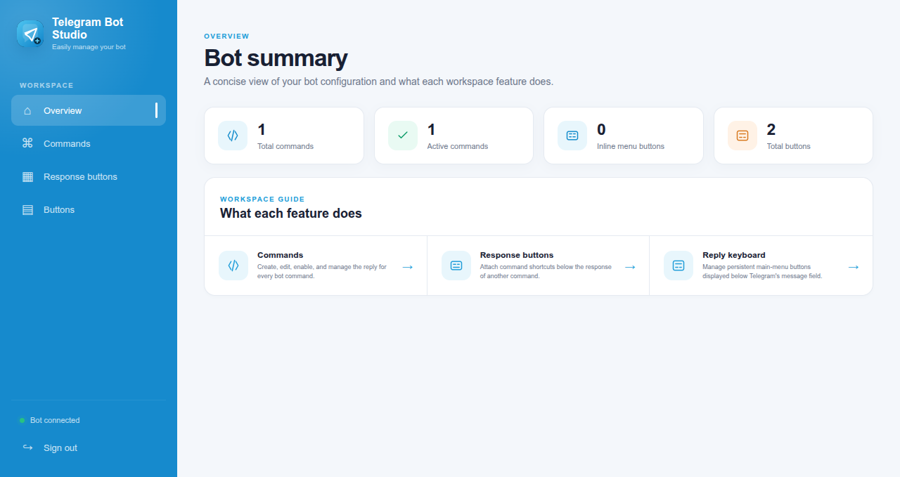

# Telegram Bot with python-telegram-bot

[](https://railway.com/deploy/python-telegram-bot?referralCode=asepsp&utm_medium=integration&utm_source=template&utm_campaign=generic)

A starter Telegram bot project built with [`python-telegram-bot`](https://python-telegram-bot.org/), environment-based configuration, Docker support, and Railway deployment setup.



## Features

- Persistent chat menu buttons after `/start`
- `/start`, `/help`, `/about`, and `/ping` commands
- Echo replies for normal text messages
- Fallback handler for unknown commands
- Error logging
- **PostgreSQL persistence** (asyncpg): users are stored/updated on `/start`
- **Redis integration**: per-user message counter and a short-lived `/ping` cache
- Configuration loaded from a local `.env` file or Railway variables
- Ready to run with Docker and Railway

## Data Stores

PostgreSQL and Redis are **optional**. When `DATABASE_URL` / `REDIS_URL` are set the bot
connects on startup; when they are missing, empty, or unreachable it logs a warning and keeps
running with that backend disabled. This makes local testing easy, while Railway just links
the services automatically.

- **PostgreSQL** — a `users` table is created automatically on first run. `/start` inserts
  a new user or refreshes `username`, `first_name`, and `last_seen` for an existing one.
  Without a database, `/start` still greets the user but nothing is persisted.
- **Redis** — `/ping` reports whether the reply came from a 10-second cache (`fresh` vs
  `cached`), and each echoed text message increments a per-user counter. Without Redis,
  `/ping` replies with a plain `pong` and the counter falls back to in-memory (per-process).

Connections are pooled (asyncpg) and reused across updates, then closed cleanly on shutdown.

## Chat Menu Buttons

The bot shows a persistent reply keyboard after `/start` with these buttons:

| Button  | Action                           |
| ------- | -------------------------------- |
| `Help`  | Show available commands          |
| `About` | Show short bot information       |
| `Ping`  | Check whether the bot is running |

Telegram bots cannot display custom buttons before a user starts or messages the bot. The keyboard appears after the bot replies, then stays available in supported Telegram clients.

## Bot Commands

| Command  | Description                      |
| -------- | -------------------------------- |
| `/start` | Show the welcome message         |
| `/help`  | Show available commands          |
| `/about` | Show short bot information       |
| `/ping`  | Check whether the bot is running |


## Project Structure

```text
.
├── bot/
│   ├── __init__.py
│   ├── cache.py        # Redis client and helpers
│   ├── config.py
│   ├── db.py           # PostgreSQL pool and queries
│   ├── handlers.py
│   └── main.py
├── .env
├── .env.example
├── .dockerignore
├── .gitignore
├── Dockerfile
├── LICENSE
├── railway.json
├── README.md
└── requirements.txt
```

## Set Up the Bot Token

1. Create a bot with Telegram `@BotFather`.
2. Copy the bot token.
3. Add the token to `.env`:

## Environment Variables

| Name           | Required | Default | Description                                        |
| -------------- | -------- | ------- | -------------------------------------------------- |
| `BOT_TOKEN`    | Yes      | -       | Bot token from `@BotFather`                        |
| `DATABASE_URL` | No       | -       | PostgreSQL connection string; omit to run without persistence |
| `REDIS_URL`    | No       | -       | Redis connection string; omit to run without caching          |
| `LOG_LEVEL`    | No       | `INFO`  | Logging level, such as `DEBUG`, `INFO`, or `ERROR` |

On Railway, add the **PostgreSQL** and **Redis** plugins to your project and reference their
connection strings from the bot service:

```text
DATABASE_URL=${{ Postgres.DATABASE_URL }}
REDIS_URL=${{ Redis.REDIS_URL }}
```

For local development you can run both with Docker:

```bash
docker run -d --name pg  -e POSTGRES_PASSWORD=postgres -p 5432:5432 postgres:16
docker run -d --name red -p 6379:6379 redis:7
```

## Install and Run Locally

Make sure Python 3.10 or newer is installed.

```bash
python -m venv .venv
source .venv/bin/activate
pip install -r requirements.txt
python -m bot.main
```

For Windows PowerShell:

```powershell
python -m venv .venv
.\.venv\Scripts\Activate.ps1
pip install -r requirements.txt
python -m bot.main
```

## Run with Docker

```bash
docker build -t telegram-bot .
docker run --env-file .env telegram-bot
```

## License

This project is licensed under the MIT License. See [LICENSE](LICENSE).
